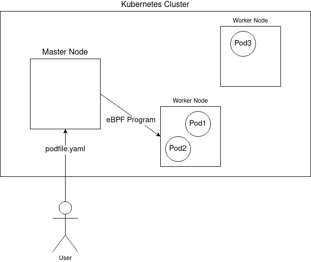

# Implementation

1. User creates pod with yaml, labeled
2. Pod created
3. Cgroup created, Event fired
4. BPF program created on master
5. Sent to correct worker
6. Attached to pod's cgroup

For the solution to be usable in a real-life scenario, it had to be scalable, meaning that managing the bandwidth of 10 pods should take roughly the same amount of effort as managing thousands.
So when implementing the program, a great emphasis was placed on ease-of-usage and automation.
The user only needs to specify the bandwidth once, in it's yaml file that will be used to create it.
Afterwards, the program will make sure that each new pod created with that pod description will have it's bandwidth limited to the specified value.

The bandwidth can be specified with a special label in the pod's yaml file.
When the file is used to create a new pod, it is sent to the master node, which notifies an availabe worker node.
The worker node creates the pod, at which point a new cgroup, belonging to the newly created pod, appears.
At the same time the cgroup is created, a *pod creation* event is fired.
This event will cause the ratelimiter, running on the master node, to generate the eBPF program with the bandwidth limitation specified in the yaml file.
This eBPF program is sent to the worker node which started the pod.
A high-level overview can be seen on the following image.

The main idea that served as the primary goal for the projects was the attachment of the BPF program to the pod's cgroup.

NOTES: én ezt a First version részt teljesen kihagynám, pontosabban nem írnám le hogy ez valami korai verzió volt. Itt inkább általánosan írnám le az alapelvet, ahogyan a BPF program elkészül, kiderül hová kell kerülnie, lefordul, betöltődik majd rákerül. Itt le lehetne írni magát a token bucketes algoritmust is akár kóddal. Meg hogy történik a BW limitáció, mondjuk egy TCP vagy UDP esetben mi lesz a különbség (semmi kb. csak UDP.nél a csomagok egy része el lesz dubva és kész, TCP-nél meg kisebb mértékben lesznek eldobva a csomagok, mert minden dobás után a TCP visszább szabályoz és egy idő után beáll arra a sebességre, ami meg lett adva a BPF token bucket kódban. Token bucket algoritmushoz az IETF RFC-t lehet mondjuk hivatkozni). 

## First Version

In the first version of the project, I deliberately left out all the Kubernetes related TODO stuff, and only concentrated on sending and attaching a BPF program to the VM.
This meant that I was able to test and provide a proof that the concept was indeed TODO working, without dealing with all the complexities of a Kubernetes cluster.
In this initial Proof of Concept, the project consisted of two separate programs, that will be described in detail below.

### Client

The client was a command line tool, with the main purpose of attaching and detaching a BPF program to the VM.
In the early stages, the BPF program it sent to the daemon was only marking the individual packets.
That was later replaced with the *shaper* used in the current version.
With the tool, the user could *attach* and *detach* a BPF program and *get the status* of the VM (does it have a program attached).
While this initial version was not the direction the project went towards later (the command-line tool was replaced with a background process that requries no user interaction), it still helped in clarifying the user requirements and providing a backbone that the next version could be built upon.

### Daemon

The daemon runs on the VM, waiting for messages from the client.
Based on the message it receives from the client, it attaches or detaches the BPF program, then sends a response to the client.
Compared to the client, the daemon remained mostly intact in the final version.

## Second Version

In the second version, the program had to be integrated into the context of a Kubernetes cluster.
The first task was to get a working Kubernetes cluster going.
My first idea was to use Minikube, which pre-configured Kubernetes cluster pre-packaged as a container or a VM.
Unfortunately this proved to be incompatible with my solution, so I had to install and configure the cluster on my machine as described above.
After the cluster was set up and running, the previous solution could be repurposed to work with Kubernetes.
Mostly the client was affected, as it now was communicating with the Kubernetes API, and not with the user.
This required it to continually run in the background, waiting for events coming from the cluster.
