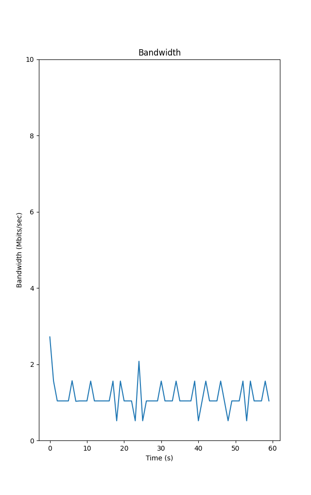
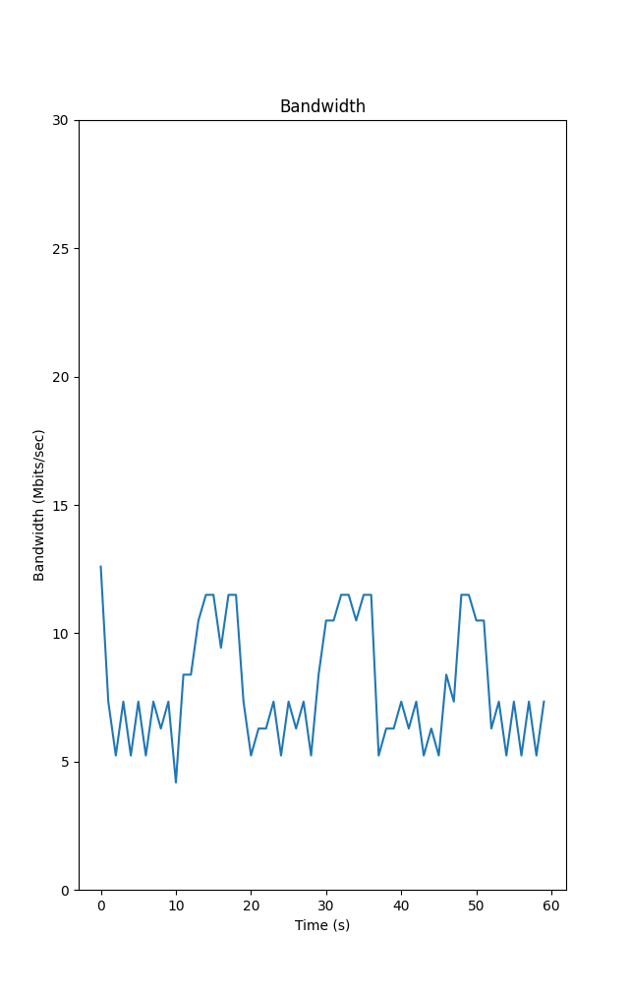
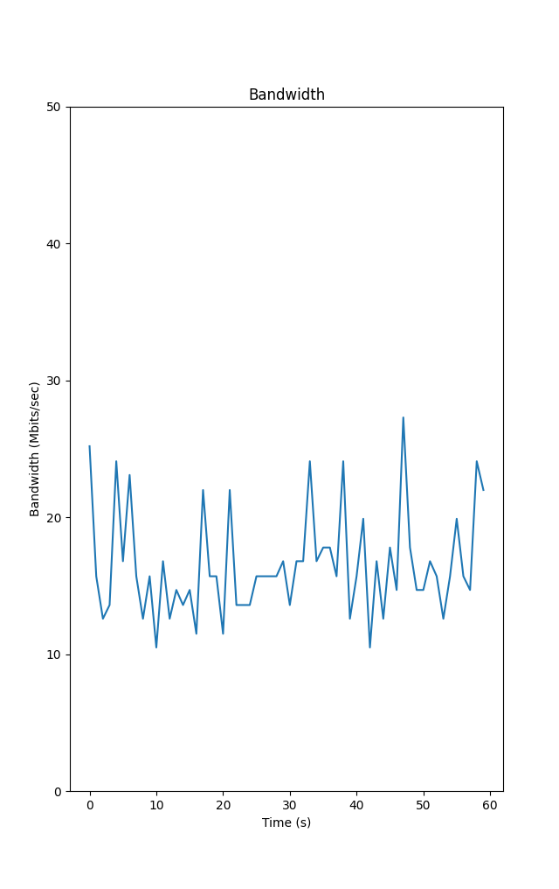

# Testing

The make sure that the project was proceeding in the right direction, the program had to be tested at each stage of the development process.
As the project was moving forward, testing the program to see if it produces the desired functionality was becoming more and more elaborate.

## Marker

The first goal of the project was to be able to compile and load the BPF program into the kernel in a suffieciently consistent manner, as it was the foundation of everything that followed.
This was done using the host operating system, using a BPF program that marked the outgoing packets.
These packets could be observed with a tool like `tcpdump`, or rules could be added with `tc` to only allow the marked packets to leave the machine.

Next, the same was done using a virtual machine.
With `tc`, rules were declared on the virtual machine that only allowed the marked packets to get through.

## Shaper

At the next stage of the project, the marker got replaced with the *shaper* program, that would remain in the final solution.
This meant that not the packet itself, but the number of packets leaving the machine were affected, so the prvious testing method couldn't be used anymore.
To test if the shaper was working as expected, various network monitoring tools (like `bmon`[^fn14]) and a tool called speedtest-cli[^fn15] were used.
These tools were able to precisely measure the incoming and outgoing rate, which could be used to tell if the shaper was working correctly.

## Containers

Under the hood, if you remove the multiple layers of abstractions, you will find that Kubernetes uses the same old container concept that you are probably familiar with.
So the next logical step was to test the shaper on a container.
To achieve this, the shaper was attached to the cgroup of the container.
Then the same tools were used to test the bandwidth, only this time it had to be done from the context of the container.
Fortunately, the docker frontend provides multiple commands that make this task almost trivial.
The `docker exec` command can be used to execute arbitrary command inside the container.
With the `-i` and `-t` flags it can even make this "interactive" (meaning that STDIN will remain open even it the container is not attached) and a pseudo-tty can be allocated respectively.
The command expects a container as argument, and a command that we want to execute inside the container.
This way, we can easily get a shell inside the container with the following command:

`docker exec -it <container_id> sh`

> *If the container has a more user-friendly shell like bash, that could be used instead.*

Now that we are inside the container, the aforementioned tools can be easily installed with the help of the available package manager.
With the tools present, the same measurements can be taken as before, confirming that the shaper functions correctly with the container.

I used *netcat* for generating network traffic, because it's small size and ubiquity.
I simply started netcat in listening mode on the recipient side, dumping it's output into `/dev/null`, and started netcat on the sender side, redirecting `/dev/random` into it.

### Container from Host

In this scenario, the recipient end of the communication was inside a container.
The image I used for setting up the container didn't contain the `ip` tool, so I checked the IP address of the container from the host with `ip neighbor`.
This lists all the hosts on the local network.
Docker uses the `172.17.0.0/24` network range, so it was easy to find the only IP that was in that range.

#### Container

- `docker run --rm -it -p10000:10000 ubuntu bash`
- `nc -l 0.0.0.0 10000 > /dev/null`
 
#### Host

- `nc 172.17.0.2 10000 < /dev/random`

### Container from Container

This time traffic was sent from a container to an other one.

#### Container 1

- `docker run --rm -it -p10000:10000 ubuntu bash`
- `nc -l 0.0.0.0 10000 > /dev/null`

#### Container 2

- `docker run --rm -it ubuntu bash`
- `nc 172.17.0.2 10000 < /dev/random`

## Kubernetes

For testing in the Kubernetes cluster, I created two custom docker images, one with netcat listening, similar to the method I used when testing the containers, and one with *iperf*.

```dockerfile
FROM alpine:3.4

RUN apk update
RUN apk add netcat-openbsd

EXPOSE 10000/tcp

CMD ["nc", "-lk", "0.0.0.0", "10000", ">", "/dev/null"]
```

```dockerfile
FROM alpine:3.4

RUN apk update
RUN apk add iperf

EXPOSE 5001/tcp

CMD ["iperf", "-s"]
```

These images were used for creating the pods, then an other pod was used to send traffic to them.
Several pod yaml file was created, each with different bandwidth limit defined in them.
The results were plotting using Python's *Matplotlib* library.




